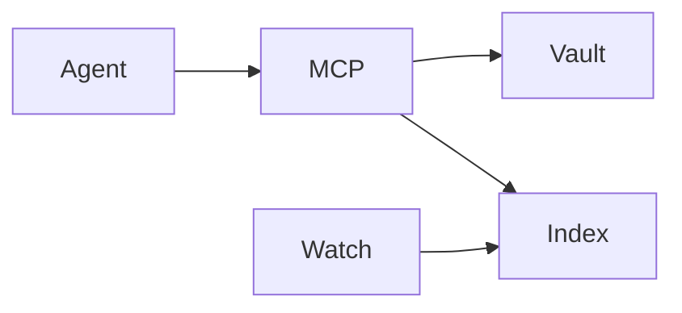

# README craft — reference

Standards for project READMEs. Repo-agnostic; pair with [SKILL.md](SKILL.md).

## Opening structure (hero)

**Good**

```markdown
<div align="center">
  
  <h1>Project</h1>
  <p><strong>One-line promise</strong></p>
  <p>Second line: what it is and who it is for.</p>
  <p>
    <a href="docs/quickstart.md"><strong>Quickstart</strong></a>
    ·
    <a href="docs/"><strong>Docs</strong></a>
  </p>
  <p>
    
    
  </p>
</div>

<details>
<summary><strong>Table of contents</strong></summary>

- [Why](#why)
- [Features](#features)
- [Architecture](#architecture)
- [Quick start](#quick-start)

</details>
```

**Bad**

```markdown
# 🚀 Welcome to Project!

Project is a powerful, seamless, next-generation platform that empowers teams
to unlock unprecedented productivity in the modern AI era.
```

Rules:

- Title is the product name — not a slogan
- Hero earns the second look in ≤3 seconds; no throat-clearing
- Icon: centered, ≈128 px display width
- Badges: ≤4, factual only (language, protocol, local-first, license/CI when real) — never fake stars or Discord spam for empty rooms
- Quick links beat a paragraph of “see docs below”

## 3-tier layout

| Tier | Belongs here | Move out if… |
|------|--------------|--------------|
| **1 Above fold** | Icon, name, promise, badges, primary links | Anything that needs scrolling to understand the pitch |
| **2 Scan** | Why table, features table, Mermaid, quick start, one usage loop | Typed API schemas, every env var, migration notes |
| **3 Supporting** | Config `<details>`, docs map, boundaries | Maintainer-only cutover / private paths |

One job per section. If a section restates the previous section, delete it.

## Information hierarchy

| Layer | Belongs in README | Belongs in linked docs |
|-------|-------------------|------------------------|
| Promise + scope | Yes (hero) | — |
| Why this model | Yes (table when comparing) | Essay-length motivation |
| Features | Yes (table) | Exhaustive capability matrix |
| Architecture | Yes (Mermaid) | Concurrency / internals |
| Shortest install | Yes | Full platform matrix |
| One worked example | Yes | Exhaustive recipes |
| Full env/config | `<details>` or link | Tuning, edge cases |
| API / schema detail | Summary table + link | Typed ops, schemas |
| Migration / legacy | Omit from share path | Maintainer docs |

## Installation paths

- Lead with the default path (one OS family is fine if stated)
- Use absolute-path **placeholders** (`/ABSOLUTE/PATH/TO/...`), never a real home directory of a named person
- Separate **required** setup from optional watcher / onboard / presets
- Verification must be a concrete command with an expected signal (tool count, search hit, health check)

## Proof over adjectives

| Avoid | Prefer |
|-------|--------|
| hybrid search that just works | hybrid BM25 + vector search over `index.db` |
| blazing-fast queries | omit, or qualify with measured setup |
| robust write API | `append_note` / `patch_note` with `expected_mtime` |
| seamless MCP integration | paste this block into `~/.cursor/mcp.json`, then full quit |

## Badges and imagery

- Zero badges is fine; if used, ≤4 factual shields
- One brand icon beats a collage or banner farm
- For freestanding icons, require real alpha transparency; a checkerboard is a viewer cue, never image content
- No Apple / Windows trademarks in generated icons; “macOS-like rounded square” means shape language only
- Screenshots / GIFs: real UI or real CLI output only

## Diagrams (prefer rendered)

- Prefer **Mermaid** (`flowchart`, `sequenceDiagram`) over ASCII — GitHub renders it
- Keep node labels short (1–2 words where possible); avoid `%%{init:...}%%` theme blocks
- Architecture: `flowchart LR` or `TD` for layers; `sequenceDiagram` for write→index or request paths
- Do not ship both ASCII and Mermaid for the same idea

**Good skeleton**

````markdown

````

## Comparison / features tables

Use a **why** table when the differentiator is “source of truth” or ops model. Use a **features** table (two columns: name | concrete behavior) instead of adjective bullets.

## Troubleshooting

- Table: symptom → fix (usually in quickstart, not root README)
- Do not bury “full quit Cursor” — MCP hosts often require it

## Anti-patterns (AI-slop tells)

1. Empty intensifiers: *powerful, robust, seamless, cutting-edge, next-generation, unlock, empower, leverage, delightful, world-class, innovative*
2. Opening *Welcome to…* / *In this guide we will…* / *Whether you’re a…*
3. Triple-restated thesis
4. Emoji section headers or badge walls / star-history when the repo is private or immature
5. Fake quotes / testimonials
6. Heading soup (H2 every three lines; H1 → H3 jumps)
7. Placeholder litter: `TODO`, `TBD`, `lorem ipsum` (install absolute-path placeholders OK)
8. Internal nicknames as if universal (“Meta”, “desk default”, private hostnames)
9. Feature laundry lists without hierarchy / tables
10. Claiming LICENSE / CONTRIBUTING / public polish before those artifacts exist
11. ASCII architecture when Mermaid would render

## Before / after (lede)

**Before:** Apo is a powerful local knowledge base that seamlessly empowers AI agents to unlock insights from your notes.

**After:** Local markdown memory for AI agents — hybrid search + MCP writes over *your* notes. Files on disk are the source of truth; the index is rebuildable.

## Before / after (diagram)

**Before:** multi-line ASCII boxes and pipes.

**After:** one Mermaid `flowchart` plus an optional `sequenceDiagram` for the write path.

## Editorial voice

- Peer to peer, not brochure
- Prefer active verbs and concrete objects
- Cut hedges that hide uncertainty; if immature, say the boundary plainly
- Humor only if dry and rare — never meme voice
