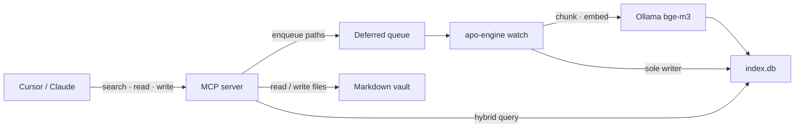
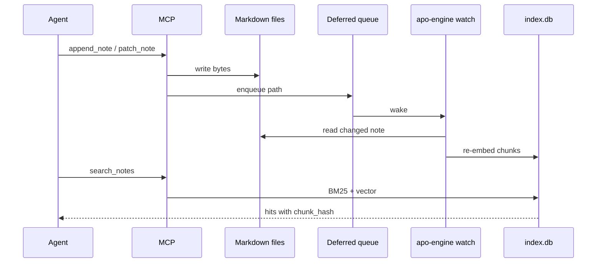

<div align="center">
  
  <h1>Apo</h1>
  <p><strong>Local markdown memory for AI agents</strong></p>
  <p>Hybrid search + MCP writes over <em>your</em> notes.<br />
  Files on disk are the source of truth; the index is rebuildable.</p>
  <p>
    <a href="docs/quickstart.md"><strong>Quickstart</strong></a>
    ·
    <a href="docs/onboard-prompt.md"><strong>Onboard</strong></a>
    ·
    <a href="docs/profiles/"><strong>Profiles</strong></a>
  </p>
  <p>
    
    
    
    
  </p>
</div>

<details>
<summary><strong>Table of contents</strong></summary>

- [Why Apo](#why-apo)
- [Structured notes (OKF and friends)](#structured-notes-okf-and-friends)
- [Features](#features)
- [Architecture](#architecture)
- [Quick start](#quick-start)
- [How agents use it](#how-agents-use-it)
- [MCP tools](#mcp-tools)
- [Configuration](#configuration)
- [Docs](#docs)
- [Boundaries](#boundaries)

</details>

## Why Apo

Most “AI memory” stacks ask you to trust a second database. Apo indexes a folder of Markdown you already own:

| Approach | Source of truth | What agents edit | Ops |
|----------|-----------------|------------------|-----|
| Cloud memory APIs | Vendor store | Opaque records | Account, network, retention policy |
| Vector DB + sync job | Vectors (+ maybe files) | Often the DB, not the note | Schema, embeddings pipeline |
| **Apo** | **Your `.md` files** | **The same files you open in an editor** | One machine, one vault, optional watcher |

You keep Obsidian / git / plain-text workflows. Agents search and surgically update notes through MCP. Delete `index.db` anytime — rebuild with `just reindex`.

## Structured notes (OKF and friends)

Apo indexes **arbitrary YAML frontmatter** into sqlite. `filter_notes` queries those fields without a vault walk — so typed concept systems (OKF-style `okf_type`, `status`, `resource`, …) and lightweight project management fall out of the same files you already edit:

```bash
# examples — any key you put in frontmatter is fair game
filter_notes({"okf_type": "EvidenceRequest", "status": "open"}, folder="projects/…")
filter_notes({"status": {"$in": ["blocked", "in-progress"]}}, folder="projects/")
filter_notes({"okf_type": "Project"}, limit=50)
```

No separate issue tracker required for “show me open X in folder Y.” Prefer `filter_notes` for frontmatter/status sweeps; use `search_notes` for semantic or keyword recall.

**Profiles:** the engine stays convention-agnostic by default (no profile → no stamp). Vaults that opt into an OKF Knowledge Bundle place `system/config/okf-profile.schema.yaml` (or set `APO_OKF_PROFILE`) and follow [docs/profiles/okf-bundle.md](docs/profiles/okf-bundle.md). `write_note` / `patch_note` then stamp/validate `okf_type` and related fields (`APO_OKF_ENFORCEMENT=off|soft|hard`).


## Features

| | |
|--|--|
| **Hybrid search** | BM25 + dense vectors (RRF-style fusion) over chunked Markdown |
| **Frontmatter catalogs** | `filter_notes` on any YAML property (`okf_type`, `status`, tags, …) |
| **MCP surface** | 15 tools (11 with `APO_MCP_LEAN=1`) for Cursor and Claude Code |
| **Surgical writes** | `append_note` / `patch_note` with heading / `chunk_hash` anchors and `expected_mtime` |
| **Index-backed graphs** | `backlinks` + `recent_activity` hit sqlite — not a vault walk |
| **Live updates** | Optional watcher drains `~/.apo/deferred-*.json` after agent writes |
| **Convention-agnostic** | Paths + YAML frontmatter only; PARA / wiki / OKF presets are optional |

## Architecture



> **Embeddings:** the default path depends on a local [Ollama](https://ollama.com) daemon and the `bge-m3` model (`just ollama && ollama pull bge-m3`). Optional ONNX via `fastembed` is supported, but Ollama is the desk/share default.

Write path (why the watcher matters):



| Layer | Role |
|-------|------|
| **Engine** (`engine/`) | Chunk, embed, hybrid search; cache frontmatter + wikilink backlinks |
| **MCP** (`engine/mcp/`) | Tool schema for hosts; never lets the agent write sqlite directly |
| **Watcher** | FS events + deferred queue → sole `index.db` writer |

## Quick start

**Need:** macOS or Linux, Homebrew (or equivalent), [Ollama](https://ollama.com), a folder of `.md` notes, ~3 GB free while `bge-m3` is loaded.

```bash
git clone <apo-repo-url> ~/Code/apo   # or your preferred path
cd ~/Code/apo
brew install ollama just              # Ollama is required for default embeddings
cp config.env.example .env            # set APO_NOTES_ROOT
just setup
just ollama && ollama pull bge-m3     # local embed daemon + model
just index
just search "a phrase you know is in your vault"
```

Register MCP for Cursor or Claude Code, install the watcher, and verify tool counts in **[docs/quickstart.md](docs/quickstart.md)**.

Then paste the **[onboard prompt](docs/onboard-prompt.md)** so agent write habits match *your* vault — not a canned layout.

## How agents use it

```text
1. search_notes "quarterly planning"        → semantic/keyword hits + chunk_hash
2. filter_notes {status: open, …}           → exact frontmatter catalog (OKF / PM)
3. append_note / patch_note                 → edit at heading or chunk_hash
4. watcher re-embeds                        → next search/filter sees the change
```

CLI equivalent while you are wiring things up:

```bash
just search "quarterly planning"
just stats
```

Prefer `append_note` / `patch_note` over full-file `write_note` for day-to-day edits.

## MCP tools

| Mode | Count | Includes |
|------|------:|----------|
| Lean (`APO_MCP_LEAN=1`) | **11** | search/read/write/catalog tools for daily agent use |
| Full | **15** | Lean + admin: `memory_status`, `reindex`, `reindex_deferred`, `reload_config` |

Core write/read tools: `search_notes`, `expand_chunk`, `read_note`, `write_note`, `append_note`, `patch_note`, `move_note`, `delete_note`, `filter_notes`, `backlinks`, `recent_activity`.

## Configuration

Minimum to boot: set `APO_NOTES_ROOT` (and usually `APO_INDEX`) in `.env`.

<details>
<summary><strong>Environment reference</strong></summary>

| Var | Default | Meaning |
|-----|---------|---------|
| `APO_NOTES_ROOT` | (required) | Absolute path to the vault root |
| `APO_INDEX` | `engine/index.db` | sqlite-vec database path |
| `APO_COLLECTION` | `notes_global` | Deferred-queue / runtime namespace |
| `APO_INGEST_DIR` | `resources/wiki` | Advisory convention for wiki ingest paths |
| `APO_EMBED_BACKEND` | `ollama` | `ollama` or `fastembed` (ONNX) |
| `APO_MODEL` | `bge-m3` | Ollama model, or a FastEmbed id when backend is `fastembed` |
| `OLLAMA_KEEP_ALIVE` | `5m` | Keep embed model warm; `0` = unload when idle |
| `WATCH_INTERVAL` | `30` | Periodic mtime scan (seconds) |
| `APO_WATCH_DEBOUNCE` | `2` | Quiet seconds before re-embedding a path |

Optional ONNX: `APO_EMBED_BACKEND=fastembed`, `APO_MODEL=BAAI/bge-large-en-v1.5`, then `just reindex`. Vectors are not interchangeable across models.

Tuning: [docs/index-concurrency.md](docs/index-concurrency.md).

</details>

## Docs

| Doc | For |
|-----|-----|
| [docs/quickstart.md](docs/quickstart.md) | Install, MCP registration, verify, troubleshoot |
| [docs/onboard-prompt.md](docs/onboard-prompt.md) | Infer vault rules → propose persistent agent instructions |
| [docs/profiles/](docs/profiles/) | Optional presets (PARA, llm-wiki) |
| [docs/index-concurrency.md](docs/index-concurrency.md) | Indexer / latency internals |
| [docs/assets/apo-icon-prompt.md](docs/assets/apo-icon-prompt.md) | App mark brief |

## Boundaries

- **Scope:** one machine, one vault root, local engine — no cloud gateway in this repo.
- **Embeddings:** default stack needs Ollama + `bge-m3` running locally; ONNX is opt-in, not a drop-in without reindex.
- **Maturity:** daily-driver quality; not claiming polished public-OSS packaging yet.
- **Layouts:** PARA / OKF / thread workflows are optional vault policy (or a [profile](docs/profiles/)), not engine requirements — frontmatter filtering works either way.

