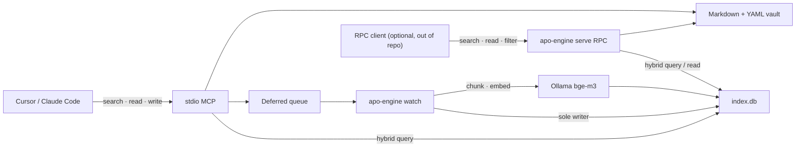
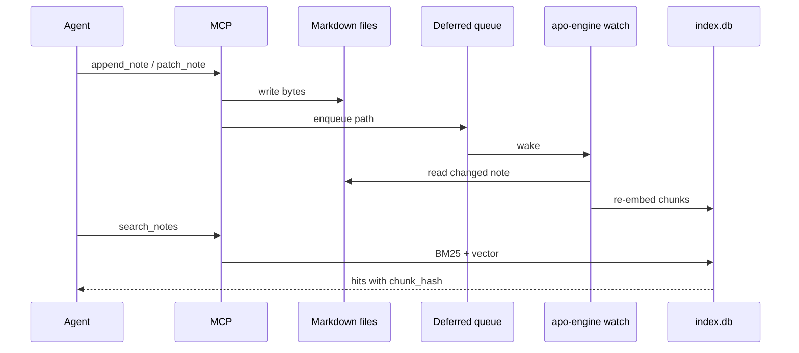

<div align="center">
  
  <p><strong>Local markdown memory for AI agents</strong></p>
  <p>Hybrid search + MCP writes over <em>your</em> notes.<br />
  Files on disk are the source of truth; the index is rebuildable.</p>
  <p>
    <a href="docs/quickstart.md"><strong>Quickstart</strong></a>
    ·
    <a href="docs/onboard-prompt.md"><strong>Onboard</strong></a>
    ·
    <a href="docs/contracts/"><strong>Contracts</strong></a>
    ·
    <a href="docs/multi-vault.md"><strong>Multi-vault</strong></a>
  </p>
  <p>
    
    
    
    
  </p>
</div>

<details>
<summary><strong>Table of contents</strong></summary>

- [Why Apo](#why-apo)
- [Structured notes (OKF and friends)](#structured-notes-okf-and-friends)
- [Features](#features)
- [Architecture](#architecture)
- [Quick start](#quick-start)
- [How agents use it](#how-agents-use-it)
- [MCP tools](#mcp-tools)
- [Configuration](#configuration)
- [Docs](#docs)
- [Boundaries](#boundaries)

</details>

## Why Apo

Most “AI memory” stacks ask you to trust a second database. Apo indexes a folder of Markdown (and optional YAML catalog records) you already own:

| Approach | Source of truth | What agents edit | Ops |
|----------|-----------------|------------------|-----|
| Cloud memory APIs | Vendor store | Opaque records | Account, network, retention policy |
| Vector DB + sync job | Vectors (+ maybe files) | Often the DB, not the note | Schema, embeddings pipeline |
| **Apo** | **Your `.md` / `.yaml` files** | **The same files you open in an editor** | One machine, one vault, optional watcher |

You keep Obsidian / git / plain-text workflows. Agents search and surgically update notes through MCP. Delete `index.db` anytime — rebuild with `just reindex`.

## Structured notes (OKF and friends)

Apo indexes **arbitrary YAML frontmatter** (Markdown) and **standalone YAML catalog notes** into sqlite. `filter_notes` queries those fields without a vault walk — so typed concept systems (OKF-style `okf_type`, `status`, `resource`, …) and lightweight project management fall out of the same files you already edit:

```bash
# examples — any key you put in frontmatter / YAML notes is fair game
filter_notes({"okf_type": "EvidenceRequest", "status": "open"}, folder="projects/…")
filter_notes({"status": {"$in": ["blocked", "in-progress"]}}, folder="projects/")
filter_notes({"okf_type": "Project"}, limit=50)
```

**Substrate split:** use **Markdown** for prose, History, session logs, wiki (`append_note`, headings). Use **`.yaml` / `.yml`** for structure-first atoms (queues, inventories, thin OKF records) — whole file is the catalog row; patch with `set_field` / `delete_field` (dotted paths for nesting). Machine contracts under `system/config/*-contract.schema.yaml` stay out of the catalog by default.

No separate issue tracker required for “show me open X in folder Y.” Prefer `filter_notes` for frontmatter/status sweeps; use `search_notes` for semantic or keyword recall.

**Contracts:** Apo is convention-agnostic until the **vault** encodes a contract it understands. Ship `system/contracts/okf-contract.schema.yaml` (or set `APO_OKF_CONTRACT`) for OKF stamp/soft/hard. Legacy `system/config/` still resolves. Templates: [docs/contracts/](docs/contracts/). Desk: `vault(action=merge|project)` + `~/.apo/desk.yaml` ([docs/examples/desk.example.yaml](docs/examples/desk.example.yaml)).

**Multi-vault:** set `APO_VAULTS` to a JSON registry (per-root `index` + `collection`). Tools take `vault=`; watch runs one thread per vault. See [docs/multi-vault.md](docs/multi-vault.md).


## Features

| | |
|--|--|
| **Hybrid search** | BM25 + dense vectors (RRF-style fusion) over chunked Markdown (+ YAML title/description fields) |
| **Frontmatter catalogs** | `filter_notes` on any YAML property (`okf_type`, `status`, tags, …) — MD frontmatter or whole-file YAML notes |
| **MCP surface** | 14 top-level tools + 7 admin capabilities via `apo_admin` |
| **Surgical writes** | `append_note` / `patch_note` with heading / `chunk_hash` anchors and `expected_mtime` |
| **Index-backed graphs** | `backlinks` + `history` (mtime browse; file git log when git contract active) hit sqlite / git — not a vault walk |
| **Live updates** | Optional watcher drains `~/.apo/deferred-*.json` after agent writes |
| **Measurable quality** | Labeled search eval (`just search-eval`, hit@k / MRR) + optional local cross-encoder reranker |
| **Convention-agnostic** | Paths + YAML (frontmatter or catalog notes); PARA / wiki / OKF presets are optional |

## Architecture


```mermaid
flowchart LR
  Agent["Cursor / Claude Code"]
  Gateway["RPC client (optional, out of repo)"]
  MCP["stdio MCP"]
  RPC["apo-engine serve RPC"]
  Queue["Deferred queue"]
  Watch["apo-engine watch"]
  Index["index.db"]
  Vault["Markdown + YAML vault"]
  Embed["Ollama bge-m3"]

  Agent -->|"search · read · write"| MCP
  Gateway -->|"search · read · filter"| RPC
  MCP --> Vault
  MCP --> Queue
  RPC -->|"hybrid query / read"| Index
  RPC --> Vault
  Queue --> Watch
  Watch -->|"chunk · embed"| Embed
  Embed --> Index
  Watch -->|"sole writer"| Index
  MCP -->|"hybrid query"| Index
```

> **Embeddings:** the default path depends on a local [Ollama](https://ollama.com) daemon and the `bge-m3` model (`just ollama && ollama pull bge-m3`). Optional ONNX via `fastembed` is supported, but Ollama is the desk/share default.

Write path (why the watcher matters):


```mermaid
sequenceDiagram
  participant Agent
  participant MCP
  participant Vault as Markdown files
  participant Queue as Deferred queue
  participant Watch as apo-engine watch
  participant Index as index.db

  Agent->>MCP: append_note / patch_note
  MCP->>Vault: write bytes
  MCP->>Queue: enqueue path
  Queue->>Watch: wake
  Watch->>Vault: read changed note
  Watch->>Index: re-embed chunks
  Agent->>MCP: search_notes
  MCP->>Index: BM25 + vector
  Index-->>Agent: hits with chunk_hash
```

| Layer | Role |
|-------|------|
| **Engine** (`engine/`) | Chunk, embed, hybrid search; cache frontmatter + wikilink backlinks |
| **MCP** (`engine/mcp/`) | Tool schema for hosts; never lets the agent write sqlite directly |
| **Watcher** | FS events + deferred queue → sole `index.db` writer |

## Quick start

**Need:** macOS or Linux, Homebrew (or equivalent), [Ollama](https://ollama.com), a folder of `.md` notes, ~3 GB free while `bge-m3` is loaded.

```bash
git clone https://github.com/jenorris/apo.git ~/Code/apo   # or your preferred path
cd ~/Code/apo
brew install ollama just              # Ollama is required for default embeddings; Python 3.11+
cp config.env.example .env            # set APO_NOTES_ROOT
just setup
just ollama && ollama pull bge-m3     # local embed daemon + model
just index
just search "a phrase you know is in your vault"
```

Register MCP for Cursor or Claude Code, install the watcher, and verify tool counts in **[docs/quickstart.md](docs/quickstart.md)**.

Then paste the **[onboard prompt](docs/onboard-prompt.md)** so agent write habits match *your* vault — not a canned layout.

## How agents use it

```text
1. search_notes "quarterly planning"        → semantic/keyword hits + chunk_hash
2. filter_notes {status: open, …}           → exact frontmatter catalog (OKF / PM)
3. append_note / patch_note                 → edit at heading or chunk_hash
4. watcher re-embeds                        → next search/filter sees the change
```

CLI equivalent while you are wiring things up:

```bash
just search "quarterly planning"
just stats
```

Prefer `append_note` / `patch_note` over full-file `write_note` for day-to-day edits.

## MCP tools

| Surface | Count | Notes |
|---------|------:|-------|
| Top-level | **10** | Core search/write + `vault` + `apo_admin` |
| Via `apo_admin` | **5** | `memory_status`, `reindex`, `reload_config`, `delete_note`, `git_sync` |

Counts are contract-tested (`engine/tests/test_apo_admin.py`) — if this table drifts from the code, CI fails.

Habit KPIs (optional): **`vault(action=stats)`**. Operator traces: OTel → Jaeger (Workbench `harness/observability/`).

## Configuration

Minimum to boot: set `APO_NOTES_ROOT` (and usually `APO_INDEX`) in `.env`.

<details>
<summary><strong>Environment reference</strong></summary>

| Var | Default | Meaning |
|-----|---------|---------|
| `APO_NOTES_ROOT` | (required) | Absolute path to the vault root |
| `APO_INDEX` | `engine/index.db` | sqlite-vec database path — recommend `~/.apo/index.db` (survives clean checkouts; multi-vault defaults there) |
| `APO_COLLECTION` | `notes_global` | Deferred-queue / runtime namespace |
| `APO_DEFERRED_DIR` | `~/.apo` | Runtime dir for queues + tool metrics (tests/sandboxes override) |
| `APO_TOOL_METRICS` | `1` | Record MCP tool-use events in `~/.apo/metrics.duckdb` (`0` disables) |
| `APO_SEARCH_EXCLUDE` | (empty) | **Deprecated** desk-wide fallback when a vault has no search-contract; prefer `system/contracts/search-contract.schema.yaml` |
| `APO_RERANK` | `0` | Opt-in local cross-encoder reranker (`pip install -e '.[rerank]'`) |
| `APO_RERANK_MODEL` | `Xenova/ms-marco-MiniLM-L-6-v2` | fastembed cross-encoder id |
| `APO_RERANK_POOL` | `24` | Fused candidates rescored before the cut to `k` |
| `APO_INGEST_DIR` | `resources/wiki` | Advisory convention for wiki ingest paths |
| `APO_SEND_ALLOW_ROOTS` | `$HOME` | Colon-separated host roots place op / host copy may read from |
| `APO_SEND_MAX_BYTES` | `5242880` | Max size for host-source `.md` copies (place op) |
| `APO_EMBED_BACKEND` | `ollama` | `ollama` or `fastembed` (ONNX) |
| `APO_MODEL` | `bge-m3` | Ollama model, or a FastEmbed id when backend is `fastembed` |
| `OLLAMA_KEEP_ALIVE` | `5m` | Keep embed model warm; `0` = unload when idle |
| `WATCH_INTERVAL` | `30` | Periodic mtime scan (seconds) |
| `APO_WATCH_DEBOUNCE` | `2` | Quiet seconds before re-embedding a path |

Optional ONNX: `APO_EMBED_BACKEND=fastembed`, `APO_MODEL=BAAI/bge-large-en-v1.5`, then `just reindex`. Vectors are not interchangeable across models.

Tuning: [docs/index-concurrency.md](docs/index-concurrency.md).

</details>

## Docs

| Doc | For |
|-----|-----|
| [docs/quickstart.md](docs/quickstart.md) | Install, MCP registration, verify, troubleshoot |
| [docs/onboard-prompt.md](docs/onboard-prompt.md) | Infer vault rules → propose persistent agent instructions |
| [docs/agent-throughput.md](docs/agent-throughput.md) | Agent habits that make Apo fast (`folder=`, `fields=`, anchors, `expected_mtime`) |
| [docs/tables.md](docs/tables.md) | Table row indexing, JSON transit, row-key `patch_note` ops, column-op gate |
| [docs/toc-navigation.md](docs/toc-navigation.md) | `read_note(mode=toc)`, sibling hops, hash staleness, pagination |
| [docs/patch-note-ops.md](docs/patch-note-ops.md) | `patch_note` wire contract (typed ops, aliases, error codes) |
| [docs/search-quality.md](docs/search-quality.md) | Eval harness, measured hit@k / MRR, reranker guidance |
| [docs/contracts/](docs/contracts/) | Contract templates (PARA, llm-wiki, OKF bundle) |
| [docs/multi-vault.md](docs/multi-vault.md) | Multi-index vault registry (`APO_VAULTS`) |
| [docs/local-rpc.md](docs/local-rpc.md) | Loopback JSON RPC for local gateways (out-of-repo clients) |
| [docs/hermes.md](docs/hermes.md) | Hermes/Lyra: Mnemosyne + Apo two-tier; desk projection (`body` + `guidance`) |
| [docs/index-concurrency.md](docs/index-concurrency.md) | Indexer / latency internals |
| [docs/assets/apo-icon-prompt.md](docs/assets/apo-icon-prompt.md) | App mark brief |

## Boundaries

- **Scope:** one machine, one vault root, local engine — no cloud gateway in this repo.
- **Embeddings:** default stack needs Ollama + `bge-m3` running locally; ONNX is opt-in, not a drop-in without reindex.
- **Maturity:** daily-driver + shareable install path; Hermes projection and usage contracts ship for autonomous hosts.
- **Layouts:** PARA / OKF / thread workflows are optional vault **contracts** (or a [template](docs/contracts/)), not engine requirements — frontmatter filtering works either way.

